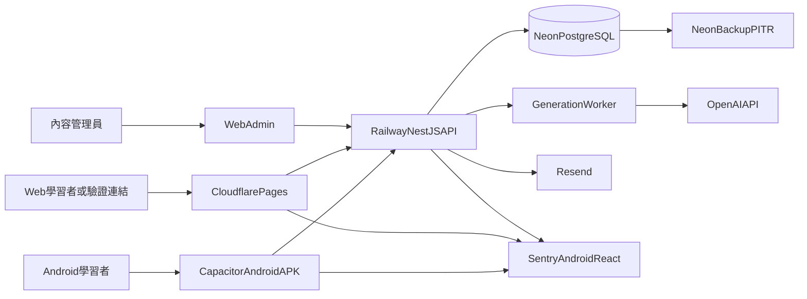

# ChunkMaster V1：私下分發 Android APK 計劃

> 更新日期：2026-09-01  
> 最終目標：學習者在主畫面看到獨立 ChunkMaster 圖示，安裝簽過名的 Android APK；以側載私下分發給自己與熟人，不上架 Google Play。  
> 技術路徑：現有 React/Vite 學習者端 + Capacitor Android；NestJS API 部署到 Railway；PostgreSQL 使用 Neon；Admin 維持 Web 後台。  
> 當前狀態：Web 核心、後端、SRS、AI 內容審核與本機測試骨架已完成；雲端 staging、Capacitor `android/`、launcher icon 與 signed APK 尚未開始。  
> 本文件是後續 Agent 的主要執行路線。實際進度與驗證結果同步記錄到 [README.md](README.md) 與 [progress.md](progress.md)。

## 1. 不可偏離的發布目標

V1 完成不是「網頁可以運行」，而是同時滿足：

1. 收件人可安裝簽過名的 ChunkMaster Android APK，主畫面出現獨立 App 名稱與圖示，而不是瀏覽器捷徑或 PWA。
2. Android App 可完成註冊、郵箱驗證、登入、學習、Challenge、SRS Review、Notes、Profile、帳號匯出及刪除。
3. Production API、資料庫、郵件及監控獨立於本機，App 不依賴 `localhost`；熟人的手機須能從外網以 HTTPS 連到 API。
4. AI 內容只能由 Web Admin 生成、人工審核及發布；Android App 不包含 Admin 入口或模型 API Key。
5. 以同一把 release keystore 簽署所有正式 APK；`applicationId` 固定，之後升級為覆蓋安裝，不是新 App。
6. 附安裝說明：允許未知來源、如何覆蓋升級、如何回報問題。不經 Google Play、不提交 Data safety／Store listing。
7. 發布後可監控 API 5xx、登入失敗、Sentry 錯誤與核心學習漏斗，並可回滾後端及停止分發有問題的 APK。

不上架 Google Play。不建立 Play Console App，不產出 AAB 作為正式交付物，不執行 Closed testing、Pre-launch report 或 Production staged rollout。

## 2. 側載與 Android 基線

- V1 交付物是 **signed release APK**（可另產 AAB 作備份，但分發與安裝以 APK 為準）。
- 收件人需在系統設定允許該檔案來源「安裝未知應用程式」。安裝說明必須寫清此步驟，並提醒只從你提供的連結安裝。
- `applicationId` 一經用於熟人安裝就不要改；改 ID 等於新 App，舊安裝不能升級、資料也不會合併。
- `versionCode` 每次正式 APK 必須遞增；`versionName` 使用可追蹤版本。
- target／compile SDK 跟隨當時穩定版 Capacitor 預設，不為側載而刻意降低安全或明文 HTTP。
- minSdk 依最新 Capacitor 支援範圍及實際測試裝置決定。
- 關閉 cleartext traffic；production／staging App 只呼叫 HTTPS API。
- 本機 USB Debug 安裝可以暫時指向開發機，但不得打進給熟人的 release APK。
- 驗證信與重設密碼連結以 HTTPS Web 頁完成即可；已驗證的 Android App Links 為加分項，不是 V1 阻擋項。
- 不申請 location、contacts、camera、microphone、廣泛 storage permission。

## 3. 目標架構



架構約束：

- Android App 的 Web assets 來自 `Frontend/dist`，由 Capacitor 打包進 APK，不在 WebView 中載入遠端整站。
- 主畫面圖示來自 Android adaptive／round icon，不是網站 favicon 捷徑。
- Android App 只呼叫 HTTPS Production／Staging API；禁止 cleartext HTTP。
- Admin 僅保留於 Web。Android production／release bundle 不顯示 `/admin` 路由及 Admin UI。
- OpenAI、Resend、Sentry server DSN、資料庫憑證只存在後端／供應商 Secret Manager。
- V1 generation worker 可先與 API 使用同一映像，但在多 replica 前必須拆出可安全 claim job 的獨立 worker。
- APK 以雲碟、即時通訊或私有下載連結分發；不要把 keystore、mapping 或未簽 debug 包當成正式檔。

## 4. 當前基線

### 已完成

- React/Vite 學習者流程：Auth、Home、Challenge、Review、Library、Mastered、Notes、Profile、Settings、Streak。
- NestJS／Prisma／PostgreSQL API、migration、Dockerfile、health、readiness、Swagger。
- 15 分鐘 access token、refresh session、郵箱驗證、密碼重設、資料匯出／刪除及 RBAC。
- 簡化 SRS、到期 Review、學習統計。
- AI generation job、JSON Schema、基本 QC、`pending_review`、Admin 審核、版本及 audit。
- Web／Native `AuthStorage` 邊界；native production build 排除 Admin，並禁止 production API 指向 localhost。
- Backend unit／service 測試、Frontend Vitest、Playwright learner smoke、CI audit 與 Gitleaks。
- 基本 Web PWA；這不等於獨立 Android 圖示，也不算 APK 交付。

### 尚未完成

- Frontend 尚未安裝 Capacitor，沒有 `android/` 工程、launcher icon 或 signed APK。
- 沒有固定 application ID、versionCode 或 release keystore。
- 尚未建立 staging／production 雲端資源及自訂域名；熟人手機因此還連不到正式 API。
- Native secure storage 仍是 stub；Android back button、keyboard、network plugin、local notification 尚未接上。
- 沒有給收件人的安裝／升級說明。
- 正式隱私／條款頁仍是草稿；私下分發不需要 Play Data safety，但仍應讓受邀者知道聯絡方式與刪除帳號入口。

## 5. 里程碑總覽

- [x] M0：Web／Backend V1 基線及本機資料庫驗證
- [ ] M1：發布身份、域名與雲端 Staging
- [ ] M2：Capacitor Android 工程、獨立圖示與可安裝 Debug App
- [ ] M3：Native Auth、安全儲存與 HTTPS 驗證流程
- [ ] M4：Android UX、網路狀態及學習功能驗收
- [ ] M5：內容、邀請說明與基本隱私頁
- [ ] M6：Signed release APK、分發與升級

已取消（不再執行）：

- Play Console、AAB 作為正式交付、Play App Signing
- Data safety、Store listing、Content rating、Target audience、App access
- Closed testing 12 人 × 14 天、Pre-launch report、Production staged rollout

任何 Agent 不得因「程式已寫」而勾選里程碑；必須完成該里程碑的驗收門檻及證據記錄。

## 6. M1：發布身份、域名與雲端 Staging

### 必須由使用者確認

- Android application ID。建議格式：`com.<持有人或公司>.chunkmaster`。用於熟人安裝後不要更改。
- App 顯示名稱（主畫面圖示下方文字）。
- 支援郵箱或聯絡方式，供受邀者回報問題與刪除帳號。
- 正式網域，例如 `chunkmaster.app`；建議：
  - `app.<domain>`：Web／驗證連結
  - `api.<domain>`：API
  - `www.<domain>`：產品、Privacy、Terms、Account deletion（可用較簡短的私下分發版本）
- 若暫無自訂網域，可先用 Railway／Cloudflare Pages 的 HTTPS 預設網址，但必須寫進 App 的 `VITE_API_BASE_URL` 與後端 `APP_URL`／`CORS_ORIGINS`。之後換網域等於要發新 APK。

### 建立帳號與資源

不要建立 Google Play Console Developer account。

- GitHub repository 與 Actions。
- Cloudflare account、網域或 Pages 預設網址、DNS。
- Neon staging／production PostgreSQL。
- Railway staging／production API，未拆 worker 前保持一個 API replica。
- Resend account 及已驗證寄件網域（或同等可送驗證信的方案）。
- Sentry Web、Android、Backend projects。
- OpenAI project、獨立 API key、用量告警及硬預算上限。

### 部署 Staging

- Railway 使用 [Backend/Dockerfile](../Backend/Dockerfile)。
- Neon 執行 `prisma migrate deploy`，禁止 `migrate dev` 及 production seed。
- Cloudflare Pages build root 為 `Frontend`，build `npm ci && npm run build`，output `dist`。
- staging 設定真實 `APP_URL`、`CORS_ORIGINS`、`DATABASE_URL`、`JWT_SECRET`、`RESEND_API_KEY`、`OPENAI_API_KEY`、`SENTRY_DSN`。
- `/health`、`/ready`、註冊、驗證、登入、refresh、Notes ownership、Admin RBAC 全部 smoke 通過。
- Web 驗證／重設密碼頁可從手機瀏覽器打開；這是 Android 郵箱流程的後備路徑。

### M1 驗收門檻

- [ ] `https://api.<domain>/health` 與 `/ready` 返回 200（或同等 HTTPS 預設網址）。
- [ ] 手機瀏覽器可以使用真實郵件完成驗證及密碼重設。
- [ ] Neon backup／restore 演練成功並記錄 RPO／RTO。
- [ ] 匿名及 learner 存取 `/admin/*` 返回 401／403。
- [ ] 所有 secret 不在 Git、前端 bundle、Android resources 或 log。
- [ ] [DEPLOYMENT.md](DEPLOYMENT.md) 更新真實域名、供應商、APK 分發方式及回滾步驟。

## 7. M2：Capacitor Android 工程與獨立圖示

### 實作路徑

在 `Frontend` 使用執行當時最新穩定版 Capacitor，不得猜版本：

```powershell
npm install @capacitor/core @capacitor/android
npm install --save-dev @capacitor/cli
npx cap init
npm run build:native:production
npx cap add android
npx cap sync android
npx cap open android
```

新增／維護：

- `Frontend/capacitor.config.ts`
- `Frontend/android/`
- npm scripts：`android:sync`、`android:open`、`android:run`、`android:apk`
- `webDir: "dist"`
- 已確認且固定的 `appId` 與 App 顯示名稱
- Debug、staging、production API 環境；給熟人的 release 不得指向 localhost

`npx cap init` 前必須已確認 application ID 與顯示名稱。不要為了「先看看」使用之後會丟掉的 ID。

### Android 設定

- 跟隨當時穩定版 Capacitor 的 SDK／WebView 要求。
- 只申請必要 permission：
  - `INTERNET`
  - Android 13+ 的通知 permission（僅在提醒功能啟用時請求）
- 關閉 cleartext traffic；使用 Network Security Config 限制 HTTPS。
- 設定 **adaptive icon、round icon、splash**，讓主畫面、應用程式清單與近期任務都顯示獨立 ChunkMaster 圖示，而不是預設 Capacitor／Android 機器人圖示。
- 設定 status bar、navigation bar 及 edge-to-edge safe area。
- App 顯示名稱與 `applicationId` 與 M1 確認值一致。

### M2 驗收門檻

- [ ] `npm run build:native:production` 後 `npx cap sync android` 成功。
- [ ] Android Studio Gradle sync、Debug build 成功。
- [ ] Emulator 及至少一台實體 Android 裝置可安裝／啟動。
- [ ] 安裝後主畫面與應用程式清單出現獨立 App 名稱與自訂圖示。
- [ ] App 不連 localhost、不顯示 Admin、不包含任何 server secret。
- [ ] 冷啟動、背景／前景切換、螢幕旋轉及系統返回鍵不造成白屏或資料遺失。

## 8. M3：Native Auth、驗證連結與安全

### Auth 儲存策略

現有 Web 仍使用 HttpOnly Cookie；Android WebView 採平台 adapter：

- 維持 `AuthStorage` interface，分為 Web 與 Native 實作。
- Android access token 優先只存在 memory。
- Android refresh token 存 Android Keystore 支援的安全儲存，不存一般 localStorage／Preferences。目前 native stub 只使用記憶體，M3 必須換成真實安全儲存。
- 後端已支援 request body refresh token；Native adapter 使用此路徑。
- logout、password reset、account deletion 必須清除 native secure storage。
- 不得在 Sentry、console、Logcat 或 analytics 記錄 token。

選擇第三方 secure storage plugin 前，Agent 必須檢查維護狀態、Android Keystore 實作、license 與最新 Capacitor 相容性；不合格則以小型 native plugin 實作。

### 郵箱驗證與密碼重設

V1 可接受系統瀏覽器完成驗證，不強制 Android App Links：

- 郵件連結打開 `https://app.<domain>/verify-email?token=...` 或 `/reset-password?token=...`。
- App 未安裝或連結在瀏覽器打開時，Web 流程必須可用。
- 若時間允許，可加 HTTPS intent filter；`assetlinks.json` 使用 **自己的 release 憑證指紋**，不是 Play App Signing 指紋。
- 測試 fresh install、已登入、未登入、過期 token、重複使用 token。

### 安全門檻

- 建立 release keystore；檔案與密碼不提交 Git，放密碼管理器並做離線備份。
- Production API 僅 HTTPS，CORS／rate limit／payload limit 保持有效。
- 私下分發仍建議限制註冊來源或在忘記密碼前加 Cloudflare Turnstile，避免網址外洩後被濫用。
- 若使用 WebView cookie，重新驗證 SameSite、Secure、第三方 Cookie 及 CSRF 行為；不得假設桌面瀏覽器結果等同 Android。

### M3 驗收門檻

- [ ] 註冊 → 郵件連結（瀏覽器或 App）→ 驗證 → 登入完整通過。
- [ ] 忘記密碼 → 重設 → 舊 session 全部失效。
- [ ] Access token 過期可安靜 refresh；refresh 重放被拒。
- [ ] 清除 App data、登出、刪除帳號後 credential 不殘留。
- [ ] 另一帳號不能讀寫原帳號 Notes／Progress。
- [ ] Android Studio inspection 未發現 hardcoded secret 或 cleartext endpoint。

## 9. M4：Android UX 與學習功能

### 必做系統整合

- Android back button：
  - Overlay／Modal 優先關閉。
  - 主頁再次返回才退出 App。
- Keyboard／輸入框：
  - Login、Register、Notes 在小螢幕及鍵盤彈出時可操作。
- Safe area／edge-to-edge：
  - 不被 status bar、navigation bar、display cutout 遮擋。
- Network：
  - 使用 Capacitor Network 或等效方案顯示離線狀態。
  - 離線時禁止假裝保存 Progress／Notes；提供重試。
- Lifecycle：
  - 背景返回後重新驗證 session。
  - 覆蓋安裝新 APK 不破壞本地 session。

### Android 提醒

- 若 Settings 顯示提醒為可用，必須用 Local Notifications 實作每日學習提醒。
- 在 Android 13+ 只於使用者主動開啟提醒時請求通知 permission。
- 提供時間選擇、取消排程及系統設定被關閉時的狀態提示。
- 若未完整實作，Settings 不得顯示為可用功能。

### 聲音與觸覺

- 驗證 Web Speech 在目標 WebView／裝置的支援；不可靠時改用維護良好的 Native TTS。
- 若 Settings 顯示 haptic 為可用，使用 Capacitor Haptics 且只在偏好啟用時觸發。
- V1 不使用 microphone，因此不申請 `RECORD_AUDIO`。

### 學習驗收

- Home、Challenge、SRS Review、Library、Mastered、Notes、Profile、Settings、Streak 全部在 Android 實機通過。
- SRS 到期、時區、跨日、streak、背景恢復及重裝後同步通過。
- Android App 中完成帳號資料匯出及刪除。

### M4 驗收門檻

- [ ] 360×640 小螢幕到實際測試機無阻斷 UI。
- [ ] 至少覆蓋你與一名受邀者會用的 Android 版本；不必為 Play 做 API 33–36 全矩陣。
- [ ] 一台實機完成 30 分鐘學習無 crash、卡死或明顯記憶體問題。
- [ ] 離線／弱網不產生假成功、重複 Progress 或 Notes 資料丟失。
- [ ] back、keyboard、驗證連結、TTS／haptics 行為符合設定。

## 10. M5：內容、邀請說明與基本隱私

### 內容發布

- 以 Admin 生產並人工審核首批學習內容；給熟人使用前未審內容不得外洩。
- 目標仍為 300–500 個 chunks（5 類、easy／medium／hard 及 CEFR 分層）。自己先裝 Debug 可用種子資料，但 **分發給他人的 release APK 所連環境** 應已有人工審核內容。
- 每項至少包含：phrase、繁中翻譯、用法、register、CEFR、2 個自然例句、填空答案及合理干擾項。

### 私下分發說明（取代 Store listing）

準備一份給收件人的短說明（可放在 `docs/` 或下載頁）：

- 只從你提供的連結安裝 APK。
- 如何允許未知來源。
- 主畫面應出現的 App 名稱與圖示，避免裝錯包。
- 註冊、驗證信、支援聯絡方式。
- 覆蓋升級：必須安裝同一 `applicationId`、更高 `versionCode`、同一簽名的 APK。
- 如何匯出或刪除帳號。

### 隱私與刪除（私下分發最低限度）

不填 Google Play Data safety。仍需要：

- App 內 Settings 的隱私政策、條款、匯出與刪除帳號。
- 受邀者可聯絡你申請刪除；Web 刪除頁若已存在應與實際行為一致，並標明適用範圍。
- 更新 [DATA_INVENTORY.md](DATA_INVENTORY.md) 與實際供應商；不要為不存在的 Play 服務編造資料流。

### M5 驗收門檻

- [ ] 分發環境的已發布內容均經人工抽查；未審內容為 0 外洩。
- [ ] 安裝說明可由未參與開發的人跟著裝完並進入 Home。
- [ ] 說明與 App 內畫面沒有宣稱尚未提供的 AI 對話、離線同步、語音評分或商店更新。
- [ ] Settings 匯出／刪除在 Android 實機可用。

## 11. M6：Signed release APK、分發與升級

### 自動測試

- Backend：unit、PostgreSQL E2E、Auth／RBAC／SRS／Generation／Admin。
- Frontend：Vitest、Playwright Web smoke。
- Android：Capacitor sync／Gradle assembleRelease；至少手動跑完核心學習流程。
- 執行 dependency audit、secret scan。

不必接 Play Pre-launch report 或 Firebase Test Lab 全裝置矩陣。

### Release build

- 使用固定 application ID。
- `versionCode` 每次正式分發必須遞增；`versionName` 使用可追蹤版本。
- 建立 release keystore，密碼和檔案只放密碼管理器／CI secret，另做離線備份。
- 產生 **signed release APK** 作為分發 artifact。
- 保留 APK、mapping（若啟用 minify）、commit SHA、migration version、release notes。
- APK 中沒有 `.env`、API key、debug endpoint、Admin secret 或 source map 私密內容。

### CI 路徑

PR：

1. Backend install／Prisma generate／migration check。
2. Backend typecheck／unit／E2E／build。
3. Frontend install／typecheck／test／build。
4. 有 `android/` 後：Capacitor sync／Android lint／Debug build。
5. Secret／dependency scan。

Tag／manual release：

1. Production frontend native build。
2. Capacitor sync。
3. Inject Android signing secrets。
4. Build signed APK。
5. 上傳到約定的私有下載位置；不得公開索引成任意下載站。

### 分發與升級

- 先自己實機安裝 signed APK，確認圖示、登入、學習、覆蓋升級。
- 再傳給少數熟人；收集安裝失敗、驗證信、crash 與內容問題。
- 沒有商店自動更新：新版本必須再傳 APK。舊版若 API 不兼容，後端需維持向後兼容或明確要求升級。
- 發現 P0／安全問題時停止分發該 APK，後端可回滾 Railway image；DB migration 採 forward-fix。

### M6 驗收門檻

- [ ] 至少一台非開發用實機以未知來源安裝 signed APK 後，主畫面有獨立圖示且可完成核心學習流程。
- [ ] 以更高 `versionCode`、同一 keystore 覆蓋安裝成功，session 不丟。
- [ ] 用另一把 key 簽名的 APK 無法偽裝成升級。
- [ ] APK 不連 localhost、不含 Admin、不含 secret。
- [ ] [README.md](README.md)、[progress.md](progress.md)、[DEPLOYMENT.md](DEPLOYMENT.md) 記錄 APK 版本、SHA256、commit 與下載方式（不要把私有連結硬編碼進公開文件若使用者不願公開）。

## 12. V1 不納入

- Google Play 上架、Play Console、AAB 正式分發、Play App Signing。
- iOS App Store。
- 完整離線寫入及衝突同步。
- 社交、排行榜、付費訂閱。
- AI 即時對話老師。
- 麥克風發音評分。
- Kubernetes／微服務全面拆分。
- 已驗證 Android App Links（可作為加分，失敗不擋 M6）。

注意：獨立 launcher icon、Capacitor Android 包裝、signed APK、native 安全儲存、系統返回鍵與網路狀態屬於 V1 必做。Local Notifications 與 Haptics 僅在 Settings 顯示為可用時必做。

## 13. 關鍵決策紀錄

後續 Agent 遇到以下未決事項必須先詢問使用者，不可自行建立不可逆資源：

- 正式 application ID。
- App 顯示名稱。
- 網域或可接受的 HTTPS 預設網址。
- 支援／隱私聯絡方式。
- 是否啟用 Analytics；未確認前不要加入追蹤 SDK。
- Release keystore 的建立及保管位置。
- APK 私有下載位置（雲碟、聊天、自建連結）。

已決定：

- 不上架 Google Play；V1 以側載 signed APK 私下分發。
- 學習者端必須是獨立 Android 圖示，不是只加到主畫面的 PWA。
- Android 包裝：Capacitor。
- Backend：Railway。
- Database：Neon PostgreSQL。
- Web／Admin：Cloudflare Pages。
- Email：Resend。
- Error tracking：Sentry。
- 首個 LLM provider：OpenAI。

## 14. 後續 Agent 開新 Context 的執行規則

每個新 context 必須依序：

1. 讀取本文件、[README.md](README.md)、[progress.md](progress.md)、[DEPLOYMENT.md](DEPLOYMENT.md)。
2. 檢查 Git status，保留使用者未提交變更；未獲要求不得 commit 或 push。
3. 找到第一個未完成里程碑，只處理該里程碑或使用者明確指定的工作。
4. 實作前查閱當時 Capacitor Android 與 Android 側載／目標 SDK 文件；不要按已取消的 Play 上架流程執行。
5. 不得把 secret 或 keystore 寫入 repo、前端、Android resources、測試 snapshot 或 log。
6. 所有 schema 變更建立 migration；禁止 production `db push`、`migrate dev`、`reset` 或自動 seed。
7. Android plugin 必須檢查維護狀態、license 與最新 Capacitor 相容性。
8. 完成工作後執行相應 typecheck、unit、E2E、Android build／test。
9. 只有驗收門檻全部通過才更新 checkbox。
10. 把日期、命令、測試結果、artifact、阻礙及下一步寫入 [progress.md](progress.md)。

里程碑更新格式：

```markdown
### YYYY-MM-DD — Mx 工作名稱
- 完成：
- 修改文件：
- 驗證命令與結果：
- Artifact／URL：
- 未完成或阻礙：
- 下一步：
```

## 15. 下一個 Context 的明確起點

下一步是 M1，不是直接加入 Capacitor：

1. 詢問並固定 application ID、App 顯示名稱、域名或 HTTPS 預設網址、支援聯絡方式。
2. 建立或確認 Cloudflare、Neon、Railway、Resend、Sentry、OpenAI 帳號（不要建立 Play Console）。
3. 先完成 staging API／DB／Email，並用手機瀏覽器跑通註冊與驗證。
4. M1 驗收通過後，再進入 M2 建立 `Frontend/android/`、獨立圖示與 Debug 安裝。
5. M6 才產出給熟人的 signed APK。

不要在 application ID、顯示名稱與可從外網連到的 API 位址未確認前執行 `npx cap init`。
