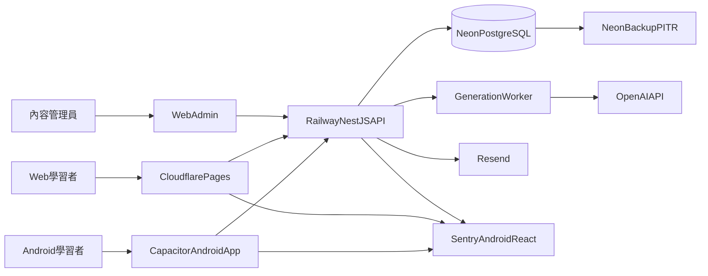

# ChunkMaster V1：Google Play 發布計劃

> 更新日期：2026-08-16  
> 最終目標：將 ChunkMaster 學習者端以 Android App Bundle（AAB）發布到 Google Play Production。  
> 技術路徑：現有 React/Vite 學習者端 + Capacitor Android；NestJS API 部署到 Railway；PostgreSQL 使用 Neon；Admin 維持 Web 後台。  
> 當前狀態：Web 核心、後端、SRS、AI 內容審核與本機測試骨架已完成；Android、雲端 staging、Play Console 與上架合規尚未開始。  
> 本文件是後續 Agent 的主要執行路線。實際進度與驗證結果同步記錄到 [README.md](README.md) 與 [progress.md](progress.md)。

## 1. 不可偏離的發布目標

V1 完成不是「網頁可以運行」，而是同時滿足：

1. 學習者可從 Google Play 安裝正式簽署的 ChunkMaster Android App。
2. Android App 可完成註冊、郵箱驗證、登入、學習、Challenge、SRS Review、Notes、Profile、帳號匯出及刪除。
3. Production API、資料庫、郵件及監控獨立於本機，App 不依賴 `localhost`。
4. AI 內容只能由 Web Admin 生成、人工審核及發布；Android App 不包含 Admin 入口或模型 API Key。
5. Google Play App content、Data safety、Privacy policy、Account deletion、Content rating、Target audience 及 App access 全部提交且與實際行為一致。
6. 通過 Internal testing、必要的 Closed testing、Pre-launch report 及 Production review。
7. 發布後可監控 crash、ANR、API 5xx、登入失敗與核心學習漏斗，並可回滾後端及停止有問題的 Android rollout。

## 2. Google Play 政策基線

執行任何上架工作前，Agent 必須重新查閱 Google 官方政策，不得只依賴本文中的日期。

- 2026-08-31 起，新 App 及更新必須 target Android 16／API 36 或以上。V1 以 `targetSdkVersion 36` 為最低發布目標；若政策再提高，跟隨 Play Console 最新要求。
- 新建立且符合 Google 條件的個人開發者帳號，Production access 前需要 Closed testing：至少 12 名 tester 連續 opt-in 14 天，之後再申請 Production access。
- 新 App 使用 Android App Bundle（`.aab`）及 Play App Signing；本地保管 upload key，Google 保管 distribution signing key。
- 所有發布軌道都需要完成 Data safety。App 有帳號建立功能，因此刪除帳號必須同時提供 App 內入口及公開 Web URL。
- Privacy policy 必須可公開訪問、不是本機檔案，內容須涵蓋 App、本公司／營運者、第三方 SDK、資料用途、保存及刪除。

官方政策入口：

- [Target API requirements](https://support.google.com/googleplay/android-developer/answer/11926878)
- [Personal account testing requirements](https://support.google.com/googleplay/android-developer/answer/14151465)
- [User Data policy](https://support.google.com/googleplay/android-developer/answer/10144311)
- [Data safety](https://support.google.com/googleplay/android-developer/answer/10787469)
- [Play App Signing](https://support.google.com/googleplay/android-developer/answer/9842756)

## 3. 目標架構



架構約束：

- Android App 的 Web assets 來自 `Frontend/dist`，由 Capacitor 打包，不在 WebView 中載入遠端整站。
- Android App 只呼叫 HTTPS Production／Staging API；禁止 cleartext HTTP。
- Admin 僅保留於 Web。Android production build 不顯示 `/admin` 路由及 Admin UI。
- OpenAI、Resend、Sentry server DSN、資料庫憑證只存在後端／供應商 Secret Manager。
- V1 generation worker 可先與 API 使用同一映像，但在多 replica 前必須拆出可安全 claim job 的獨立 worker。

## 4. 當前基線

### 已完成

- React/Vite 學習者流程：Auth、Home、Challenge、Review、Library、Mastered、Notes、Profile、Settings、Streak。
- NestJS／Prisma／PostgreSQL API、migration、Dockerfile、health、readiness、Swagger。
- 15 分鐘 access token、refresh session、郵箱驗證、密碼重設、資料匯出／刪除及 RBAC。
- 簡化 SRS、到期 Review、學習統計。
- AI generation job、JSON Schema、基本 QC、`pending_review`、Admin 審核、版本及 audit。
- Backend unit 3/3、PostgreSQL E2E 1/1、前後端 build／typecheck、dependency audit。
- 基本 Web PWA；這不等於 Android App，也不算 Google Play 交付。

### 尚未完成

- Frontend 尚未安裝 Capacitor，沒有 `android/` 工程。
- 沒有固定 application ID、versionCode、upload key、AAB 或 Play Console App。
- 尚未建立 staging／production 雲端資源及自訂域名。
- Native auth storage、Android App Links、Android back button、safe area、keyboard、network state、notification permission 尚未處理。
- 沒有 Android emulator／實機自動與手動測試矩陣。
- Privacy policy 現為草稿；缺少公開 account deletion Web 頁面。
- Data safety、Content rating、Target audience、App access、Store listing 尚未填寫。
- 尚未招募 Closed testing tester，也未進行 14 天測試。

## 5. 里程碑總覽

- [x] M0：Web／Backend V1 基線及本機資料庫驗證
- [ ] M1：發布身份、域名與雲端 Staging
- [ ] M2：Capacitor Android 工程與可安裝 Debug App
- [ ] M3：Native Auth、Deep Link、安全儲存與 Android 系統整合
- [ ] M4：Android UX、提醒、網路狀態及學習功能驗收
- [ ] M5：內容、法律文件、Data Safety 與 Store Listing
- [ ] M6：Android 測試、Release AAB、簽署與 CI
- [ ] M7：Play Internal／Closed Testing 與 Production access
- [ ] M8：Google Play Production 發布與 48 小時監控

任何 Agent 不得因「程式已寫」而勾選里程碑；必須完成該里程碑的驗收門檻及證據記錄。

## 6. M1：發布身份、域名與雲端 Staging

### 必須由使用者確認

- Play Console 使用個人帳號或組織帳號。
- Android application ID。建議格式：`com.<持有人或公司>.chunkmaster`。Play Console 建立 App 後不可隨意更改。
- App 正式名稱、開發者名稱、支援郵箱、隱私聯絡人及營運司法地區。
- 正式網域，例如 `chunkmaster.app`；建議：
  - `app.<domain>`：Web／驗證連結
  - `api.<domain>`：API
  - `www.<domain>`：產品、Privacy、Terms、Account deletion

### 建立帳號與資源

- Google Play Console Developer account，完成身份驗證及 2-Step Verification。
- GitHub repository 與 Actions。
- Cloudflare account、網域、DNS、Pages。
- Neon staging／production PostgreSQL。
- Railway staging／production API，未拆 worker 前保持一個 API replica。
- Resend account 及已驗證寄件網域。
- Sentry Web、Android、Backend projects。
- OpenAI project、獨立 API key、用量告警及硬預算上限。

### 部署 Staging

- Railway 使用 [Backend/Dockerfile](../Backend/Dockerfile)。
- Neon 執行 `prisma migrate deploy`，禁止 `migrate dev` 及 production seed。
- Cloudflare Pages build root 為 `Frontend`，build `npm ci && npm run build`，output `dist`。
- staging 設定真實 `APP_URL`、`CORS_ORIGINS`、`DATABASE_URL`、`JWT_SECRET`、`RESEND_API_KEY`、`OPENAI_API_KEY`、`SENTRY_DSN`。
- `/health`、`/ready`、註冊、驗證、登入、refresh、Notes ownership、Admin RBAC 全部 smoke 通過。
- 建立可公開訪問的 Privacy、Terms、Support、Account deletion 頁面；不可只提供 App 內頁。

### M1 驗收門檻

- [ ] `https://api.<domain>/health` 與 `/ready` 返回 200。
- [ ] staging Android／Web 可以使用真實郵件完成驗證及密碼重設。
- [ ] Neon backup／restore 演練成功並記錄 RPO／RTO。
- [ ] 匿名及 learner 存取 `/admin/*` 返回 401／403。
- [ ] 所有 secret 不在 Git、前端 bundle、Android resources 或 log。
- [ ] [DEPLOYMENT.md](DEPLOYMENT.md) 更新真實域名、供應商及回滾步驟。

## 7. M2：Capacitor Android 工程

### 實作路徑

在 `Frontend` 使用執行當時最新穩定版 Capacitor，不得猜版本：

```powershell
npm install @capacitor/core @capacitor/android
npm install --save-dev @capacitor/cli
npx cap init
npm run build
npx cap add android
npx cap sync android
npx cap open android
```

新增／維護：

- `Frontend/capacitor.config.ts`
- `Frontend/android/`
- npm scripts：`android:sync`、`android:open`、`android:run`、`android:bundle`
- `webDir: "dist"`
- 已確認且固定的 `appId`
- Debug、staging、production API 環境，不允許 production 指向 localhost

### Android 設定

- target API 36 或 Play Console 當時更高要求。
- minSdk 依最新 Capacitor 支援範圍及測試裝置決定，不由 Agent自行降低安全要求。
- 只申請必要 permission：
  - `INTERNET`
  - Android 13+ 的通知 permission（僅在提醒功能啟用時請求）
- V1 不申請 location、contacts、camera、microphone、廣泛 storage permission。
- 關閉 cleartext traffic；使用 Network Security Config 限制 HTTPS。
- 設定 adaptive icon、round icon、splash、status bar、navigation bar 及 edge-to-edge safe area。
- App 顯示名稱與 package application ID 與 Play Console 一致。

### M2 驗收門檻

- [ ] `npm run build` 後 `npx cap sync android` 成功。
- [ ] Android Studio Gradle sync、Debug build 成功。
- [ ] Emulator 及至少一台實體 Android 裝置可安裝／啟動。
- [ ] App 不連 localhost、不顯示 Admin、不包含任何 server secret。
- [ ] 冷啟動、背景／前景切換、螢幕旋轉及系統返回鍵不造成白屏或資料遺失。

## 8. M3：Native Auth、Deep Link 與安全

### Auth 儲存策略

現有 Web 仍使用 HttpOnly Cookie；Android WebView 採平台 adapter：

- 建立 `AuthStorage` interface，分為 Web 與 Native 實作。
- Android access token 優先只存在 memory。
- Android refresh token 存 Android Keystore 支援的安全儲存，不存一般 localStorage／Preferences。
- 後端已支援 request body refresh token；Native adapter 使用此路徑。
- logout、password reset、account deletion 必須清除 native secure storage。
- 不得在 Sentry、console、Logcat 或 analytics 記錄 token。

選擇第三方 secure storage plugin 前，Agent 必須檢查維護狀態、Android Keystore 實作、license、最新 Capacitor 相容性及 Play SDK policy；不合格則以小型 native plugin 實作。

### App Links

- 郵箱驗證及密碼重設使用 HTTPS Android App Links：
  - `https://app.<domain>/verify-email?token=...`
  - `https://app.<domain>/reset-password?token=...`
- 設定 Android intent filter。
- 在網域發布 `/.well-known/assetlinks.json`，內容包含正式 package ID 及 Play signing certificate fingerprint。
- App 未安裝時連結回落到 Web；已安裝時可在 App 內完成。
- 測試 fresh install、已登入、未登入、過期 token、重複使用 token。

### 安全門檻

- 啟用 Play App Signing 與 2-Step Verification。
- Upload key 不提交 Git；使用密碼管理器／CI secret 儲存，另做離線備份。
- Production API 僅 HTTPS，CORS／rate limit／payload limit 保持有效。
- 建議在公開註冊及忘記密碼前加入 Cloudflare Turnstile 或等效防濫用。
- 若使用 WebView cookie，重新驗證 SameSite、Secure、第三方 Cookie 及 CSRF 行為；不得假設桌面瀏覽器結果等同 Android。

### M3 驗收門檻

- [ ] 註冊 → 郵箱 App Link → 驗證 → 登入完整通過。
- [ ] 忘記密碼 → App Link → 重設 → 舊 session 全部失效。
- [ ] Access token 過期可安靜 refresh；refresh 重放被拒。
- [ ] 清除 App data、登出、刪除帳號後 credential 不殘留。
- [ ] 另一帳號不能讀寫原帳號 Notes／Progress。
- [ ] MobSF／Android Studio inspection 未發現 hardcoded secret 或 cleartext endpoint。

## 9. M4：Android UX 與學習功能

### 必做系統整合

- Android back button：
  - Overlay／Modal 優先關閉。
  - 主頁再次返回才退出 App。
- Keyboard／輸入框：
  - Login、Register、Notes 在小螢幕及鍵盤彈出時可操作。
- Safe area／edge-to-edge：
  - 不被 status bar、navigation bar、display cutout 遮擋。
- Network：
  - 使用 Capacitor Network 或等效方案顯示離線狀態。
  - 離線時禁止假裝保存 Progress／Notes；提供重試。
- Lifecycle：
  - 背景返回後重新驗證 session。
  - App 更新或 Web assets 變更不破壞本地 session。

### Android 提醒

- 使用 Local Notifications 實作每日學習提醒。
- 在 Android 13+ 只於使用者主動開啟提醒時請求通知 permission。
- 提供時間選擇、取消排程及系統設定被關閉時的狀態提示。
- 通知點擊進入 Home／Review。
- 若未完整實作，Settings 不得顯示為可用功能。

### 聲音與觸覺

- 驗證 Web Speech 在目標 WebView／裝置的支援；不可靠時改用維護良好的 Native TTS。
- Haptics 使用 Capacitor Haptics，只在偏好啟用時觸發。
- V1 不使用 microphone，因此不申請 `RECORD_AUDIO`。

### 學習驗收

- Home、Challenge、SRS Review、Library、Mastered、Notes、Profile、Settings、Streak 全部在 Android 實機通過。
- SRS 到期、時區、跨日、streak、背景恢復及重裝後同步通過。
- Android App 中完成帳號資料匯出及刪除；外部 account deletion URL 同樣可用。

### M4 驗收門檻

- [ ] 360×640 小螢幕到主流大螢幕無阻斷 UI。
- [ ] Android 13、14、15、16／API 33–36 至少以 emulator 或實機覆蓋。
- [ ] 一台低階實機完成 30 分鐘學習無 crash、卡死或明顯記憶體問題。
- [ ] 離線／弱網不產生假成功、重複 Progress 或 Notes 資料丟失。
- [ ] notification、back、keyboard、deep link、TTS／haptics 行為符合設定。

## 10. M5：內容、法律、Data Safety 與 Store Listing

### 內容發布

- 以 Admin 生產並人工審核 300–500 個 chunks。
- 覆蓋 5 類、easy／medium／hard 及 CEFR 分層。
- 每項至少包含：phrase、繁中翻譯、用法、register、CEFR、2 個自然例句、填空答案及合理干擾項。
- 補齊資料模型，確保 `usage`、`register`、`cefr`、多例句與模型／prompt／token 成本實際持久化。
- Generation 加入 timeout、有限重試、失敗清理、資料庫全域去重及 50 條批次回歸。

### Play Console App content

- App category：Education。
- Ads declaration：若無廣告，明確選擇 No；後續加入任何廣告 SDK 必須重填。
- App access：提供 Google reviewer 可用、無 2FA 阻擋的審核帳號與英文操作指引。
- Target audience：依真實定位填寫；若包含兒童，先重新評估 Families policy，不可隨意選低年齡。
- Content rating questionnaire：依學習內容如實回答。
- Data safety：逐項審核 App、Sentry、Resend、OpenAI、analytics 及所有 Capacitor plugin 的收集／分享行為。
- Account deletion：
  - App 內 Settings 入口。
  - 公開 HTTPS Web 頁面，可在未安裝 App 時申請刪除。
- Privacy policy 需寫明 email、學習進度、筆記、診斷資料、第三方處理者、保存時間、刪除及聯絡方式。

### Store Listing 素材

- App name、short description、full description（至少繁中及英文版本）。
- 512×512 store icon。
- 1024×500 feature graphic。
- 真實 Android phone screenshots；不得只放設計稿或誤導性功能。
- 支援郵箱、網站、Privacy URL、Account deletion URL。
- Release notes、版本命名與使用者支援流程。

### M5 驗收門檻

- [ ] Data inventory 與 Data safety 答案逐項對得上實際程式及第三方 SDK。
- [ ] Privacy／Terms／Deletion URL 在未登入、App 外部可訪問。
- [ ] Google reviewer 帳號可完成核心學習流程。
- [ ] Store listing 沒有宣稱尚未提供的 AI 對話、離線同步、語音評分等功能。
- [ ] 300–500 個內容通過人工抽查，未審內容為 0 外洩。

## 11. M6：測試、Release AAB、簽署與 CI

### 自動測試

- Backend：unit、PostgreSQL E2E、Auth／RBAC／SRS／Generation／Admin。
- Frontend：component、API contract、Playwright Web smoke。
- Android：
  - Capacitor sync／Gradle build。
  - Espresso 或 Maestro 核心流程。
  - App Links、notification、back、offline、upgrade。
- 使用 Play Console Pre-launch report 及 Firebase Test Lab／等效裝置矩陣。
- 執行 dependency audit、secret scan、MobSF、Sentry source map／mapping upload。

### Release build

- 使用固定 application ID。
- `versionCode` 每次 Play upload 必須遞增；`versionName` 使用可追蹤版本。
- 建立 upload keystore，密碼和檔案只放 CI secrets／安全備份。
- 啟用 Play App Signing。
- 產生 signed release AAB，不發布 APK 作 Production artifact。
- 保留 AAB、mapping、commit SHA、migration version、release notes 及測試報告。

### CI 路徑

PR：

1. Backend install／Prisma generate／migration check。
2. Backend typecheck／unit／E2E／build。
3. Frontend install／typecheck／test／build。
4. Capacitor sync／Android lint／unit test／Debug build。
5. Secret／dependency scan。

Tag／manual release：

1. Production frontend build。
2. Capacitor sync。
3. Inject Android signing secrets。
4. Build signed AAB。
5. 上傳 Internal testing track；不得直接推 Production。

### M6 驗收門檻

- [ ] Clean checkout 可由 CI 重建相同 AAB。
- [ ] Release AAB target API 符合 Play 當時要求。
- [ ] `versionCode`、application ID、signing certificate 正確。
- [ ] AAB 中沒有 `.env`、API key、debug endpoint、Admin secret 或 source map 私密內容。
- [ ] Pre-launch report 無阻斷 crash、ANR、安全或可訪問性問題。

## 12. M7：Play Internal／Closed Testing

### Internal testing

- 先上傳 signed AAB 到 Internal testing。
- 驗證 Play 安裝、Play App Signing、App Links certificate fingerprint、更新安裝及 crash reporting。
- 團隊完成至少一輪完整 smoke test。

### Closed testing

若 Play Console 顯示新個人帳號 Production access 限制：

- 建立正式 Closed testing track，不以 Internal testing 代替。
- 招募至少 12 名 tester，建議 15–20 名避免退出導致重算。
- Tester 以真實 Google 帳號 opt-in，連續保持至少 14 天。
- 收集裝置／Android 版本、成功／失敗流程、crash、ANR、內容錯誤及建議。
- 測試期間至少發布一個經驗證的修正版，確認 upgrade path。
- 保存測試計劃、回饋、修復紀錄及 Production access 問卷答案。

Closed testing 核心腳本：

1. 安裝／首次啟動。
2. 註冊、郵箱 App Link、登入。
3. 完成 10 個 chunks、一次 Challenge、一次 Review。
4. 新增／編輯／刪除 Note。
5. 修改提醒並驗證 notification。
6. 離線、弱網、背景恢復、重新啟動。
7. 資料匯出及刪除測試帳號。

### M7 驗收門檻

- [ ] Internal track 的安裝與更新正常。
- [ ] 若適用，至少 12 名 tester 連續 opt-in 14 天且沒有跌破門檻。
- [ ] P0／P1 問題為 0，P2 有明確處置。
- [ ] Crash-free users、ANR、API 5xx 及核心完成率達成發布門檻。
- [ ] Production access 問卷提交並獲批准。

## 13. M8：Production 發布

### Go／No-Go

只有全部通過才可發布：

- Production DB backup、restore rehearsal、migration 及 rollback runbook 通過。
- Production API health／ready、郵件、Sentry、OpenAI budget alert 正常。
- Android AAB、Play signing、Data safety、App content、Privacy、Deletion、Store listing 全部完成。
- 核心 Android 實機、Pre-launch report、Closed testing 通過。
- 首批 300–500 個人工審核內容已發布；未審內容不外洩。
- 支援郵箱、事故責任人、狀態頁及客服回覆流程已就緒。

### 發布方式

- 先 staged rollout 5%。
- 觀察至少 24 小時，再依 10% → 25% → 50% → 100% 擴大。
- 任一 P0、安全、資料損壞、登入大面積失敗、crash／ANR 超標立即停止 rollout。
- Android 客戶端問題使用 Play halt rollout／新 versionCode 修復；後端問題回滾 Railway image，但 DB migration 採 forward-fix。

### 發布後 48 小時監控

- Play Console crash、ANR、Pre-launch／Android vitals。
- Sentry Android／Web／Backend。
- `/health`、`/ready`、5xx、DB connection、OpenAI 429／成本。
- 註冊成功率、郵箱驗證率、首課完成率、Review 完成率。
- 內容回報、刪除帳號、隱私及客服請求。

### M8 完成證據

- [ ] Google Play Production listing URL。
- [ ] 正式 package ID、versionName、versionCode、release commit SHA。
- [ ] 100% rollout 時間。
- [ ] 48 小時監控報告及所有事故／修復紀錄。
- [ ] [README.md](README.md)、[progress.md](progress.md)、[DEPLOYMENT.md](DEPLOYMENT.md) 更新為正式發布狀態。

## 14. V1 不納入

- iOS App Store。
- 完整離線寫入及衝突同步。
- 社交、排行榜、付費訂閱。
- AI 即時對話老師。
- 麥克風發音評分。
- Kubernetes／微服務全面拆分。

注意：Android 原生包裝、Local Notifications、Haptics、App Links、安全儲存現在屬於 V1 必做，不再列為 V1.1。

## 15. 關鍵決策紀錄

後續 Agent 遇到以下未決事項必須先詢問使用者，不可自行建立不可逆資源：

- Google Play account：個人或組織。
- 正式 application ID。
- App 正式名稱及開發者名稱。
- 網域、公司／個人法律名稱、司法地區。
- 隱私／支援聯絡資料。
- 是否啟用 Analytics；未確認前不要加入追蹤 SDK。
- Closed testing tester 名單。
- Upload key 的建立及保管位置。

可逆且已有預設的決策：

- Android 包裝：Capacitor。
- Backend：Railway。
- Database：Neon PostgreSQL。
- Web／Admin：Cloudflare Pages。
- Email：Resend。
- Error tracking：Sentry。
- 首個 LLM provider：OpenAI。

## 16. 後續 Agent 開新 Context 的執行規則

每個新 context 必須依序：

1. 讀取本文件、[README.md](README.md)、[progress.md](progress.md)、[DEPLOYMENT.md](DEPLOYMENT.md)。
2. 檢查 Git status，保留使用者未提交變更；未獲要求不得 commit 或 push。
3. 找到第一個未完成里程碑，只處理該里程碑或使用者明確指定的工作。
4. 實作前重新查閱 Google Play／Android 官方最新政策及目標 API。
5. 不得把 secret 寫入 repo、前端、Android resources、測試 snapshot 或 log。
6. 所有 schema 變更建立 migration；禁止 production `db push`、`migrate dev`、`reset` 或自動 seed。
7. Android plugin 必須檢查維護狀態、license、最新 Capacitor 相容性及 Play SDK policy。
8. 完成工作後執行相應 typecheck、unit、E2E、Android build／test。
9. 只有驗收門檻全部通過才更新 checkbox。
10. 把日期、命令、測試結果、artifact、阻礙及下一步寫入 [progress.md](progress.md)。

里程碑更新格式：

```markdown
### YYYY-MM-DD — Mx 工作名稱
- 完成：
- 修改文件：
- 驗證命令與結果：
- Artifact／URL：
- 未完成或阻礙：
- 下一步：
```

## 17. 下一個 Context 的明確起點

下一步是 M1，不是直接加入 Capacitor：

1. 詢問並固定個人／組織 Play Console 帳號類型。
2. 詢問並固定 application ID、App 名稱、開發者名稱、域名及支援郵箱。
3. 建立或確認 Play Console、Cloudflare、Neon、Railway、Resend、Sentry、OpenAI 帳號。
4. 先完成 staging API／DB／Email／Privacy／Deletion URL。
5. M1 驗收通過後，再進入 M2 建立 `Frontend/android/`。

不要在 application ID、網域、帳號持有人未確認前執行 `npx cap init` 或在 Play Console 建立正式 App。
