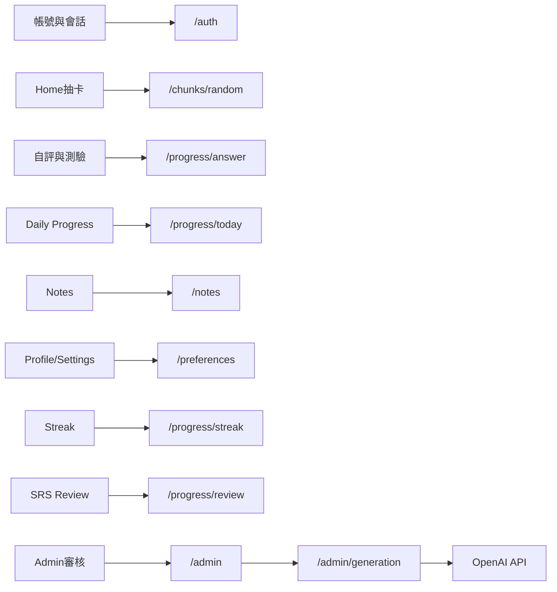

# ChunkMaster 開發進度總結

> **更新日期**：2026-08-16  
> **產品定位**：以 chunk（片語／語塊）為單位的英語學習 App  
> **技術棧**：Frontend — React + Vite + TypeScript + PWA／Capacitor Android（待建）；Backend — NestJS + Prisma + PostgreSQL  
> **發布目標**：Google Play Android Production；Web 保留學習入口及 Admin 後台  
> **當前階段**：Web／Backend 核心與部署骨架完成；Google Play 路線進入 M1 發布身份、域名與雲端 staging

---

## 一、前端已完成內容

### 1. 應用殼層與導航
- 登入／註冊閘門：未登入僅顯示 Auth 頁面
- 底部 TabBar：`Home` / `Notes` / `Profile`
- Overlay 頁面（隱藏 TabBar）：Library、Streak、Mastered、Challenge、Review、Settings
- App Header（品牌 + 頭像）：Home／Notes 顯示；Profile 使用自有綠色頭圖區

### 2. 認證與會話
- 登入／註冊對接真實後端 `/auth`
- 郵箱驗證、忘記密碼、重設密碼及前端錯誤提示
- 15 分鐘 access token + 可輪替 refresh session；支援 HttpOnly Cookie 與 Bearer 相容層
- 啟動時呼叫 `/auth/me` 校驗，401 時嘗試 refresh；失敗才清除會話
- Settings 支援登出、帳號資料匯出及密碼確認後刪除帳號

### 3. 學習主流程（Home）
- 分類 Pill 篩選 + 隨機抽卡（`GET /chunks/random`）
- `ChunkCard`：片語、翻譯模糊揭示、例句
- 揭示答案後選擇「Still learning／I remembered」，不再固定回報答對
- `POST /progress/answer` 同時記錄真實結果與反應時間
- Daily Progress 進度條讀取後端今日完成數／目標
- 連續打卡數字讀取後端 streak
- 達成每日目標時出現 Complete Today / Keep Learning
- 答對可播放短音效（受 Settings 音效開關控制）

### 4. 挑戰與複習
- **Challenge**：填空題挑戰（複用 `FillBlankCard`），計分並寫入 progress
- **Review（SRS）**：只練習已到期項目；空佇列顯示完成狀態，不再塞入隨機題
- **Library**：只瀏覽真正學過的 chunks，顯示 mastered／needsReview；支援搜尋、分類、例句與語音朗讀
- **Mastered**：僅顯示已掌握 chunks（共用 Library 元件邏輯）

### 5. 筆記（Notes）
- 雲端 CRUD（不再僅靠 localStorage）
- 搜尋、分類過濾（`CategoryPills` + `SearchBar`）
- 點擊編輯、長按多選、批次刪除確認模態框
- 新增／編輯表單（`NoteFormModal`）
- Note 資料模型可關聯來源 Chunk，為後續從卡片建立筆記保留資料能力

### 6. 個人頁與設定
- **Profile**：綠色頭圖、頭像、用戶名、本週習慣、每日目標、種類分佈餅圖（Learned／Mastered／Notes 真實數據）
- 統計 API 失敗時顯示錯誤／空狀態，不再回退到假數據
- 調整每日目標同步 Preferences API，並影響 Home 進度條上限
- **Settings**：音效／自動下一張偏好、未提供功能提示、登出、資料匯出、刪除帳號、隱私政策與條款

### 7. Streak
- 連續天數、本週／總練習天數讀取後端
- 日曆顯示真實打卡日期（`GET /progress/calendar`）

### 8. 設計系統與可複用元件
- 設計 tokens（`C`）、3D 按壓交互（`usePress`）
- UI：Button、Card、Pill、CategoryPills、SearchBar、Modal、ConfirmModal、Calendar、ProgressBar、Toggle、BackButton 等
- Business：ChunkCard、FillBlankCard、EmptyState、NoteFormModal、WeeklyHabitCard、DailyGoalCard、CategoryPieChart

### 9. PWA 與 Admin
- PWA manifest、icon、service worker、SPA redirect 及基本唯讀快取
- `/admin` 受角色保護，提供 Dashboard、待審列表、生成任務及內容生命週期操作
- Admin 可設定 category、difficulty、batch size，並執行 Edit／Approve／Reject／Retire／Restore
- 管理操作寫入 AuditEvent

---

## 二、後端已完成內容

### 1. 基礎設施
- NestJS 11 模組化架構 + Prisma ORM + PostgreSQL 16
- JWT／Cookie 認證、RBAC、Helmet、CORS allowlist、rate limit、request ID
- Docker Compose 啟動資料庫；種子腳本擴充至約 15 條多分類 idioms
- Backend multi-stage Dockerfile、GitHub Actions CI、Swagger `/docs`
- `/health` 與含 DB 探活的 `/ready`
- 前後端 Sentry 初始化及後端結構化 HTTP 日誌

### 2. Auth（`/auth`）
| 方法 | 路徑 | 說明 |
|------|------|------|
| POST | `/auth/register` | 註冊（bcrypt、建立預設 Preferences），回傳 token + user |
| POST | `/auth/login` | 登入，回傳 token + user |
| POST | `/auth/verify-email` | 驗證郵箱 token |
| POST | `/auth/forgot-password` | 申請密碼重設 |
| POST | `/auth/reset-password` | 使用 token 更新密碼並撤銷舊 session |
| POST | `/auth/refresh` | 輪替 refresh session |
| POST | `/auth/logout` | 撤銷 session 並清除 Cookie |
| GET | `/auth/me` | 取得當前用戶資料（需 JWT） |
| GET | `/auth/account/export` | 匯出帳號、偏好、筆記及進度 |
| DELETE | `/auth/account` | 密碼確認後刪除帳號 |

### 3. Chunks（`/chunks`）
| 方法 | 路徑 | 說明 |
|------|------|------|
| GET | `/chunks` | 列表（可按 category 篩選；僅 `published`） |
| GET | `/chunks/random` | 隨機一題（可按 category） |

### 4. Progress（`/progress`，需 JWT）
| 方法 | 路徑 | 說明 |
|------|------|------|
| POST | `/progress/answer` | 記錄答案／反應時間；更新 SRS、DailyProgress 與 streak |
| GET | `/progress/today` | 今日完成數、目標、當前 streak |
| GET | `/progress/streak` | 當前／最長 streak、本週習慣格、總練習天 |
| GET | `/progress/calendar` | 指定年月打卡日曆 |
| GET | `/progress/learning` | 用戶所有學習進度（含 chunk） |
| GET | `/progress/review` | `dueAt <= now` 的 SRS 到期隊列 |
| GET | `/progress/stats/categories` | 種類分佈統計（學習／掌握／待複習） |

### 5. Preferences（`/preferences`，需 JWT）
| 方法 | 路徑 | 說明 |
|------|------|------|
| GET | `/preferences` | 讀取每日目標與各開關 |
| PATCH | `/preferences` | 更新每日目標／音效／提醒／觸覺／自動下一張 |

### 6. Notes（`/notes`，需 JWT）
| 方法 | 路徑 | 說明 |
|------|------|------|
| GET | `/notes` | 列表 |
| GET | `/notes/stats/categories` | 筆記種類統計 |
| POST | `/notes` | 新增 |
| PATCH | `/notes/:id` | 更新 |
| DELETE | `/notes` | 批次刪除 |
| DELETE | `/notes/:id` | 單筆刪除 |

### 7. Generation（`/admin/generation`，需 content_admin）
- HTTP 只建立 job；PostgreSQL job queue 在背景處理
- OpenAI 使用 JSON Schema 結構化輸出；無 API key 或模型失敗時 job 失敗，不使用模板冒充內容
- 支援冪等鍵、批次 1–50、每日 job 上限、category／difficulty 白名單
- 自動檢查必填欄位、填空、答案／選項及批次重複
- 生成內容只進 `pending_review`，不會直接供學習者使用

### 8. Admin（`/admin`）
- Dashboard：用戶、待審、已發布、已下架及失敗 job 統計
- Content：列表、詳情、編輯、核准、拒絕、下架及恢復
- 內容狀態：`draft → generating → pending_review → published／rejected → retired`
- 每次重要操作建立 ContentVersion 與 AuditEvent
- reviewer 可審核；只有 content_admin／super_admin 可生成或下架

### 9. SRS
- LearningProgress 保存 stability、difficulty、dueAt、lapseCount、lastResponseMs
- 答錯約 10 分鐘後到期；答對按穩定度增加複習間隔
- Review 按 dueAt 排序，最多返回 50 個項目
- `retired` 內容不再出現在公開題庫，但舊學習進度保留

### 10. 資料模型（Prisma）
- User、UserPreference、UserSession、EmailVerificationToken、PasswordResetToken
- Chunk、ChunkExample、ContentPoolItem、ContentVersion
- LearningProgress、DailyProgress、Note
- QuizQuestion、QuizOption、GenerationJob、AuditEvent
- UserRole：learner／content_reviewer／content_admin／super_admin

---

## 三、前後端打通現況（對比早期評估）

早期評估時「僅 Chunks 接通、其餘多為 Mock」。目前核心閉環已接通：

**一句話**：ChunkMaster 已具備學習者閉環、帳號安全、SRS、AI 內容生產、人工審核與部署骨架，現正進入內容準備及發布驗收。

---

## 四、工程驗證現況

2026-08-16 本機驗證：

- `prisma validate` 通過
- 兩個 migrations 成功套用，`prisma migrate status` 顯示 schema 已是最新
- Backend unit tests 3/3 通過
- PostgreSQL E2E 1/1 通過，確認跨帳號 Notes 隔離
- Backend build 通過
- Frontend typecheck 與 production build 通過
- 前後端 production dependency audit：0 vulnerabilities

詳細命令與部署流程見 [README](README.md) 及 [DEPLOYMENT](DEPLOYMENT.md)。

---

## 五、尚待完成

### 1. V1 發布工作
- 確認 Play Console 帳號類型、application ID、App／開發者名稱、網域、支援及隱私聯絡資料
- 建立 Cloudflare Pages、Railway、Neon、Resend、OpenAI、Sentry 的 staging／production 資源
- 建立 Capacitor Android 工程，完成 native auth、安全儲存、App Links、notification、back button、safe area 與網路狀態
- 建立 signed AAB、Play App Signing、Android CI、實機矩陣及 Pre-launch report
- 完成 Data safety、App content、Privacy、Account deletion 與 Store listing
- 若帳號適用，完成至少 12 名 tester 連續 14 天 Closed testing，再申請 Production access
- 準備並人工審核首批 300–500 個 chunks
- 進行 Play Internal／Closed Beta，完成核心流程與內容品質修正
- 執行 Neon 備份還原及應用回滾演練
- 完成正式隱私政策、條款、支援方式及狀態頁

### 2. 測試與品質
- 前端 Playwright：登入、學習、Review、Notes、Admin
- axe／Lighthouse 可訪問性與 PWA 驗收
- 弱網、API 失敗、session 過期及 refresh 重放測試
- Generation 50 條批次、冪等及模型失敗回歸測試

### 3. V1.1／V2
- 完整 FSRS、弱項分析及學習建議
- 聽音選義、跟讀評分、重組句子、配對與情境對話
- 完整離線寫入與同步衝突
- 原生 iOS、社交與付費功能

> Android 原生包裝、本地提醒、haptic、App Links 及 native secure storage 已改為 Google Play V1 必做，不屬於 V1.1。

---

## 六、下一階段衝刺焦點

1. 確認 Play Console 帳號、application ID、App 身份、網域與聯絡資料
2. 建立 staging 雲端資源並完成部署 smoke test
3. M1 通過後建立 Capacitor Android 工程
4. 以 Admin 工作流生產、審核首批 300–500 個 chunks
5. 依 [V1 計劃](V1_PLAN.md) 完成 AAB、Play 測試與 Production staged rollout

V1 公開發布前不得跳過人工內容審核、資料備份、權限驗證及回滾演練。
