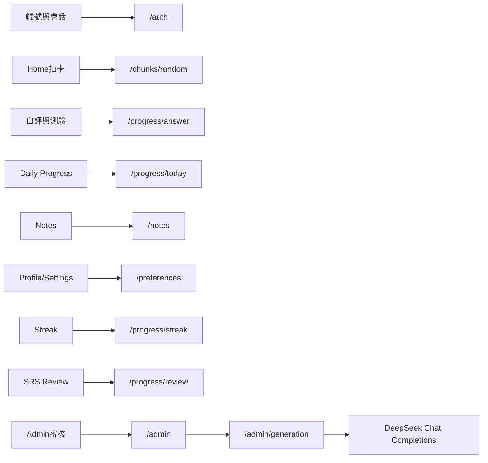

# ChunkMaster 開發進度總結

> **更新日期**：2026-09-07
> **產品定位**：以 chunk（片語／語塊）為單位的英語學習 App  
> **技術棧**：Frontend — React + Vite + TypeScript + PWA／Capacitor Android（待建）；Backend — NestJS + Prisma + PostgreSQL；LLM — DeepSeek Chat Completions（本機已接通）  
> **發布目標**：私下分發 signed Android APK（獨立主畫面圖示）；Web 保留學習入口及 Admin 後台。不上架 Google Play。  
> **當前階段**：本機 Admin → DeepSeek 生成 → 待審 → 核准 → 學習端可用，已實測成功。Admin 生成 UX、同一天可重排、分類內防重複 prompt（`v1.3.0`）已接上。下一里程碑仍是 [V1_PLAN.md](V1_PLAN.md) **M1**（發布身份、域名、雲端 staging）。尚未建立 Capacitor `android/`，正式 300–500 條審核內容尚未量產。

---

### 2026-09-07 — Admin 生成 UX、取消日冪等、分類防重複 prompt
- 完成：
  - Admin 待審列表改為獨立全頁（可捲動）；主畫面用四個狀態按鈕進入待審／已發布／已拒絕／已下架。Dashboard 統計卡含 users、pending、published、rejected、retired、failedJobs。
  - 生成表單改為左描述右下拉：種類、難易度、數量；「建立生成任務」須確認模態。確定後按鈕鎖定為「任務已排程...」，每 3 秒輪詢 job 直到 `success`／`failed`（逾時 6 分鐘解鎖）。成功綠字、失敗紅字顯示 `errorMessage`；「重新整理」清除提示但進行中 job 保持鎖定。
  - 取消「同一使用者＋同一 UTC 日＋同一分類／難度／triggerReason」冪等擋下。同一天可連續排兩次相同種類。每日 20 筆 job、每小時 10 次 API、單次 batch 1–50 仍有效。
  - Prompt 升為 `v1.3.0`：打模型前只把**該分類**已有 `phrase` 塞進禁止清單（最多 1000，`EXISTING_PHRASE_PROMPT_LIMIT`）。批次內／全域 `phraseKey` 去重與 unique 衝突跳過仍保留。
  - Dashboard API 補 `rejected` 計數。`AI_BASE_URL` 必須是完整 completions 路徑（`https://api.deepseek.com/chat/completions`）；只寫 host 會 404，因程式用 `fetch` 不會像 OpenAI SDK 自動補路徑。
- 修改文件：
  - `Frontend/src/app/pages/Admin/adminScreen.tsx`、`Frontend/src/app/api.ts`、`Frontend/src/app/App.tsx`
  - `Backend/src/generation/generation.service.ts`、`Backend/src/admin/admin.service.ts`
  - `Backend/tests/generation.service.test.ts`、`Backend/tests/admin.service.test.ts`
- 驗證命令與結果：
  - Backend generation unit／flow tests：通過（含同一天兩次 createJob、prompt 只含同分類片語）。
  - Admin 本機：確認模態、鎖定、輪詢、綠／紅字已接上；`GET /admin/generation/jobs/:id` 輪詢可見於 Nest HTTP log。
- Artifact／URL：
  - 僅本機；無公開 API／APK。
- 給下一個 Agent 的已知陷阱：
  - `AI_BASE_URL` 對 `fetch` 是最終 POST 網址，不是 SDK `baseURL`。正確值：`https://api.deepseek.com/chat/completions`。
  - HTTP 201 只表示 job 入列。打模型是背景 worker；404／401 不重試。
  - 中途殺掉 `running` job 可能卡住，worker 重啟只撈 `pending`。沒有自動 reclaim。
  - Admin 編輯仍是一連串 `window.prompt`；狀態列表頁不會自動刷新。
  - 禁止清單只含該分類片語；跨分類相同 `phraseKey` 仍在入庫時被 DB unique 擋掉。
  - Resend／正式郵件、Sentry 雲端、Capacitor Android 仍未做。
- 下一步（見第六節）：
  - 不要重做 LLM 接線或 Admin 生成表單，除非要改卡住 job 回收或編輯 UI。
  - 本機可繼續量產並人工審核。發布主線仍是 M1。

---

### 2026-09-06 — 本機 DeepSeek 生成管線已接通並實測
- 完成：
  - 本機 Docker PostgreSQL 已運行；`chunklearning` 庫含 3 條 migration（含 `20260817190000_content_generation_v1`），schema 為最新。
  - Generation 改為可設定供應商：預設 `AI_BASE_URL=https://api.deepseek.com/chat/completions`。DeepSeek 使用 `response_format: json_object`（不支援 OpenAI `json_schema`）；打 `api.openai.com` 時仍用 json_schema。
  - API key 讀 `AI_API_KEY`／`DEEPSEEK_API_KEY`／`OPENAI_API_KEY`（本機把 DeepSeek key 放在 `OPENAI_API_KEY`）。模型讀 `AI_MODEL` 或 `OPENAI_MODEL`（已用 `deepseek-v4-flash`／`deepseek-v4-pro` 驗證）。
  - Prompt `v1.2.0` 含 json 範例；未開 DeepSeek thinking。逾時預設 60s。
  - 使用者以 super_admin 在 Web `/admin` 建立 job，真實模型產出進 `pending_review`，核准後學習端可用。
- 修改文件：
  - `Backend/src/generation/generation.service.ts`、`Backend/tests/generation.service.test.ts`、`Backend/.env.example`
- 驗證命令與結果：
  - Backend generation unit／flow tests：通過（含 DeepSeek 走 json_object、OpenAI URL 走 json_schema）。
  - 本機 Admin 真實 DeepSeek 批次：成功（待審有內容，可核准）。
  - 首次誤把 DeepSeek key 打到 `api.openai.com` 得到 403；改 URL 後排除。
- Artifact／URL：
  - 僅本機；無公開 API／APK。金鑰只在 `Backend/.env`，不得提交 Git。
- 給下一個 Agent 的已知陷阱：
  - **冪等：** 同一使用者、同一 UTC 日、同一 `category`+`difficulty`+`triggerReason`（前端寫死 `admin-v1-batch`）會直接退回舊 job，**失敗的也不重跑**。`POST /admin/generation/jobs` 在 3–10ms 回 201 **不代表**正在生成。要重試必須換分類或難度，或先處理 DB 裡的舊 `GenerationJob`。
  - HTTP 成功只表示 job 已收下；模型在 worker 背景跑。成敗看 `GenerationService` log 或 `GET /admin/generation/jobs` 的 `status`／`errorMessage`。
  - 待審未核准就關 Nest：資料仍在 Postgres。`docker compose down -v` 會清掉。中途殺掉 `running` job 可能卡住，worker 重啟只撈 `pending`。
  - Admin 編輯仍是一連串 `window.prompt`；畫面不會自動刷新待審。
  - Resend／正式郵件、Sentry 雲端、Capacitor Android 仍未做。
- 下一步（見第六節）：
  - 不要再把「接通 LLM」當未完成項。本機可繼續用 Admin 量產並人工審核內容。
  - 發布路線下一項仍是 M1：application ID、顯示名稱、可從外網連的 HTTPS API，再 Capacitor APK。

---

### 2026-09-01 — 發布目標改為私下分發 APK
- 完成：
  - 確認 V1 不上架 Google Play；學習者端必須是 Capacitor 包裝的獨立 Android 圖示，以 signed APK 側載給自己與熟人。
  - 重寫 [V1_PLAN.md](V1_PLAN.md)：取消 Play Console、AAB、Data safety、Closed testing 與 Production staged rollout。
  - 新里程碑收斂為 M1 雲端 staging → M2 圖示與 Debug 安裝 → M3 native auth → M4 實機 UX → M5 內容與邀請說明 → M6 signed APK 分發。
  - 同步 [README.md](README.md)、[DEPLOYMENT.md](DEPLOYMENT.md)、[DATA_INVENTORY.md](DATA_INVENTORY.md)。
- 修改文件：
  - `docs/V1_PLAN.md`、`docs/README.md`、`docs/progress.md`、`docs/DEPLOYMENT.md`、`docs/DATA_INVENTORY.md`
- 驗證命令與結果：
  - 僅文件變更；未跑產品測試。
- Artifact／URL：
  - 無新 APK、無公開 URL。
- 未完成或阻礙：
  - application ID、App 顯示名稱、網域與雲端帳號仍未確認。
  - 尚未執行 Capacitor init。
- 下一步：
  - 固定 M1 身份與可從外網連到的 HTTPS API，再建立 `Frontend/android/`。

---

### 2026-08-17 — V1 本地先行工程
- 完成：
  - 內容模型加入 `usage`、`register`、`cefr`、正規化 `phraseKey` 及有順序的多例句；建立 `20260817190000_content_generation_v1` migration。
  - Generation 加入有限重試、timeout、失敗清理、資料庫全域去重，以及 provider／model／token／成本持久化；Admin 可編輯及審核完整內容欄位。
  - 建立 Web／Native `AuthStorage` 與 platform 邊界；Native stub 只使用記憶體，未將 refresh token 寫入 localStorage。Production／staging build 禁止缺少 API URL 或指向 localhost，native production bundle 排除 Admin。
  - 改善 safe area、小螢幕／鍵盤、網路錯誤、郵箱驗證／密碼重設狀態；未實作的 Reminder／Haptics 暫不顯示為可用。
  - Backend 測試擴充至 Auth session、refresh rotation/replay、logout、RBAC、SRS、Generation 及 Admin；Frontend 加入 Vitest 與 4 條 Playwright learner smoke。
  - CI 加入前後端 dependency audit、Frontend unit/smoke 與 Gitleaks secret scan。
  - 完成 Privacy、Terms、Account deletion、Support 及 [Data inventory](DATA_INVENTORY.md) 發布前草稿；未知法律及供應商資料均保留為發布阻塞。
- 修改文件：
  - `Backend/prisma/`、`Backend/src/admin/`、`Backend/src/generation/`、`Backend/src/content-pool/`、`Backend/tests/`
  - `Frontend/src/app/`、`Frontend/src/styles/`、`Frontend/tests/`、`Frontend/public/`、Frontend build/test 設定
  - `.github/workflows/ci.yml`、`docs/DATA_INVENTORY.md`
- 驗證命令與結果：
  - `npx prisma generate && npx prisma validate`：通過。
  - `npm run typecheck && npm test && npm run build`（Backend）：通過，unit／service tests 22/22。
  - `npm run typecheck && npm test && npm run build`（Frontend，使用非 localhost 測試 API URL）：通過，Vitest 5/5（含離線及網路失敗）。
  - `npm run build:native:production`：通過；bundle 搜尋不到 Admin 入口或 `chunk_auth_*` localStorage key。
  - `npm run test:smoke`：Playwright 8/8 通過，以桌面及 360×640 Android viewport 覆蓋註冊／登入、學習／Review、Notes、匯出／刪除／登出。
  - 前後端 `npm audit --audit-level=high --registry=https://registry.npmjs.org`：0 vulnerabilities。
  - production 缺少 `VITE_API_BASE_URL` 的負向建置測試：按設計失敗。
- Artifact／URL：
  - 本機 `Frontend/dist`（native production assets；非 APK）。
  - 尚無公開 URL、Android 工程、signed APK 或外部服務資源。
- 未完成或阻礙：
  - 本機 Docker Desktop／PostgreSQL 未運行；`prisma migrate deploy` 與 PostgreSQL E2E 因 `localhost:5432` 無法連線而未通過執行驗證。
  - 本機未安裝 Gitleaks；secret scan 已加入 CI，但尚待 CI 執行證據。
  - 未使用 OpenAI、Resend、Sentry 或任何雲端帳號；AI 測試使用 mock，不能計入正式 300–500 條內容。
  - 正式 application ID、App 顯示名稱及網域未確認，因此未執行 Capacitor init。
- 下一步：
  - 啟動本機 PostgreSQL 後套用 migration、執行 seed 與 E2E，先處理任何正規化後重複 phrase。
  - 確認 M1 發布身份與域名，再建立 staging 及 Capacitor Android 工程。

---

## 一、前端已完成內容

### 1. 應用殼層與導航
- 登入／註冊閘門：未登入僅顯示 Auth 頁面
- 底部 TabBar：`Home` / `Notes` / `Profile`
- Overlay 頁面（隱藏 TabBar）：Library、Streak、Mastered、Challenge、Review、Settings
- App Header（品牌 + 頭像）：Home／Notes 顯示；Profile 使用自有綠色頭圖區

### 2. 認證與會話
- 登入／註冊對接真實後端 `/auth`
- 郵箱驗證、忘記密碼、重設密碼及前端錯誤提示
- 15 分鐘 access token + 可輪替 refresh session；支援 HttpOnly Cookie 與 Bearer 相容層
- 啟動時呼叫 `/auth/me` 校驗，401 時嘗試 refresh；失敗才清除會話
- Settings 支援登出、帳號資料匯出及密碼確認後刪除帳號

### 3. 學習主流程（Home）
- 分類 Pill 篩選 + 隨機抽卡（`GET /chunks/random`）
- `ChunkCard`：片語、翻譯模糊揭示、例句
- 揭示答案後選擇「Still learning／I remembered」，不再固定回報答對
- `POST /progress/answer` 同時記錄真實結果與反應時間
- Daily Progress 進度條讀取後端今日完成數／目標
- 連續打卡數字讀取後端 streak
- 達成每日目標時出現 Complete Today / Keep Learning
- 答對可播放短音效（受 Settings 音效開關控制）

### 4. 挑戰與複習
- **Challenge**：填空題挑戰（複用 `FillBlankCard`），計分並寫入 progress
- **Review（SRS）**：只練習已到期項目；空佇列顯示完成狀態，不再塞入隨機題
- **Library**：只瀏覽真正學過的 chunks，顯示 mastered／needsReview；支援搜尋、分類、例句與語音朗讀
- **Mastered**：僅顯示已掌握 chunks（共用 Library 元件邏輯）

### 5. 筆記（Notes）
- 雲端 CRUD（不再僅靠 localStorage）
- 搜尋、分類過濾（`CategoryPills` + `SearchBar`）
- 點擊編輯、長按多選、批次刪除確認模態框
- 新增／編輯表單（`NoteFormModal`）
- Note 資料模型可關聯來源 Chunk，為後續從卡片建立筆記保留資料能力

### 6. 個人頁與設定
- **Profile**：綠色頭圖、頭像、用戶名、本週習慣、每日目標、種類分佈餅圖（Learned／Mastered／Notes 真實數據）
- 統計 API 失敗時顯示錯誤／空狀態，不再回退到假數據
- 調整每日目標同步 Preferences API，並影響 Home 進度條上限
- **Settings**：音效／自動下一張偏好、未提供功能提示、登出、資料匯出、刪除帳號、隱私政策與條款

### 7. Streak
- 連續天數、本週／總練習天數讀取後端
- 日曆顯示真實打卡日期（`GET /progress/calendar`）

### 8. 設計系統與可複用元件
- 設計 tokens（`C`）、3D 按壓交互（`usePress`）
- UI：Button、Card、Pill、CategoryPills、SearchBar、Modal、ConfirmModal、Calendar、ProgressBar、Toggle、BackButton 等
- Business：ChunkCard、FillBlankCard、EmptyState、NoteFormModal、WeeklyHabitCard、DailyGoalCard、CategoryPieChart

### 9. PWA 與 Admin
- PWA manifest、icon、service worker、SPA redirect 及基本唯讀快取
- `/admin` 受角色保護；Dashboard 統計＋生成表單＋四個狀態入口
- 生成：確認模態後鎖定按鈕並輪詢 job；成功／失敗在按鈕下方綠／紅字提示
- 各狀態為獨立可捲動頁（頂部狀態名＋左上返回）；可 Edit／Approve／Reject／Retire／Restore
- 管理操作寫入 AuditEvent

---

## 二、後端已完成內容

### 1. 基礎設施
- NestJS 11 模組化架構 + Prisma ORM + PostgreSQL 16
- JWT／Cookie 認證、RBAC、Helmet、CORS allowlist、rate limit、request ID
- Docker Compose 啟動資料庫；種子腳本擴充至約 15 條多分類 idioms
- Backend multi-stage Dockerfile、GitHub Actions CI、Swagger `/docs`
- `/health` 與含 DB 探活的 `/ready`
- 前後端 Sentry 初始化及後端結構化 HTTP 日誌

### 2. Auth（`/auth`）
| 方法 | 路徑 | 說明 |
|------|------|------|
| POST | `/auth/register` | 註冊（bcrypt、建立預設 Preferences），回傳 token + user |
| POST | `/auth/login` | 登入，回傳 token + user |
| POST | `/auth/verify-email` | 驗證郵箱 token |
| POST | `/auth/forgot-password` | 申請密碼重設 |
| POST | `/auth/reset-password` | 使用 token 更新密碼並撤銷舊 session |
| POST | `/auth/refresh` | 輪替 refresh session |
| POST | `/auth/logout` | 撤銷 session 並清除 Cookie |
| GET | `/auth/me` | 取得當前用戶資料（需 JWT） |
| GET | `/auth/account/export` | 匯出帳號、偏好、筆記及進度 |
| DELETE | `/auth/account` | 密碼確認後刪除帳號 |

### 3. Chunks（`/chunks`）
| 方法 | 路徑 | 說明 |
|------|------|------|
| GET | `/chunks` | 列表（可按 category 篩選；僅 `published`） |
| GET | `/chunks/random` | 隨機一題（可按 category） |

### 4. Progress（`/progress`，需 JWT）
| 方法 | 路徑 | 說明 |
|------|------|------|
| POST | `/progress/answer` | 記錄答案／反應時間；更新 SRS、DailyProgress 與 streak |
| GET | `/progress/today` | 今日完成數、目標、當前 streak |
| GET | `/progress/streak` | 當前／最長 streak、本週習慣格、總練習天 |
| GET | `/progress/calendar` | 指定年月打卡日曆 |
| GET | `/progress/learning` | 用戶所有學習進度（含 chunk） |
| GET | `/progress/review` | `dueAt <= now` 的 SRS 到期隊列 |
| GET | `/progress/stats/categories` | 種類分佈統計（學習／掌握／待複習） |

### 5. Preferences（`/preferences`，需 JWT）
| 方法 | 路徑 | 說明 |
|------|------|------|
| GET | `/preferences` | 讀取每日目標與各開關 |
| PATCH | `/preferences` | 更新每日目標／音效／提醒／觸覺／自動下一張 |

### 6. Notes（`/notes`，需 JWT）
| 方法 | 路徑 | 說明 |
|------|------|------|
| GET | `/notes` | 列表 |
| GET | `/notes/stats/categories` | 筆記種類統計 |
| POST | `/notes` | 新增 |
| PATCH | `/notes/:id` | 更新 |
| DELETE | `/notes` | 批次刪除 |
| DELETE | `/notes/:id` | 單筆刪除 |

### 7. Generation（`/admin/generation`，需 content_admin）
- HTTP 只建立 job；API 行程內 worker 每 5 秒撈 `pending`（`GENERATION_WORKER_ENABLED`）
- **本機已接通 DeepSeek**（`AI_BASE_URL` 須含 `/chat/completions` + `json_object`）。無 key 或模型失敗時 job 失敗，不使用模板冒充內容
- 打 OpenAI 相容 URL 時仍可用 `json_schema`；由 `AI_JSON_MODE` 或是否 `deepseek.com` 決定
- Prompt `v1.3.0`：只把該分類已有 phrase 列入禁止清單；另有批次內／全域 `phraseKey` 去重
- 已取消日冪等；同一天同一分類可重排。仍限制批次 1–50、每日 job 上限、category／difficulty 白名單
- 自動檢查必填欄位、填空、答案／選項、CEFR
- 生成內容只進 `pending_review`，核准後才 `published`，學習 API 只讀已發布內容

### 8. Admin（`/admin`）
- Dashboard：用戶、待審、已發布、已拒絕、已下架及失敗 job 統計
- Content：依狀態分頁列表、詳情、編輯、核准、拒絕、下架及恢復
- 內容狀態：`draft → generating → pending_review → published／rejected → retired`
- 每次重要操作建立 ContentVersion 與 AuditEvent
- reviewer 可審核；只有 content_admin／super_admin 可生成或下架

### 9. SRS
- LearningProgress 保存 stability、difficulty、dueAt、lapseCount、lastResponseMs
- 答錯約 10 分鐘後到期；答對按穩定度增加複習間隔
- Review 按 dueAt 排序，最多返回 50 個項目
- `retired` 內容不再出現在公開題庫，但舊學習進度保留

### 10. 資料模型（Prisma）
- User、UserPreference、UserSession、EmailVerificationToken、PasswordResetToken
- Chunk、ChunkExample、ContentPoolItem、ContentVersion
- LearningProgress、DailyProgress、Note
- QuizQuestion、QuizOption、GenerationJob、AuditEvent
- UserRole：learner／content_reviewer／content_admin／super_admin

---

## 三、前後端打通現況（對比早期評估）

早期評估時「僅 Chunks 接通、其餘多為 Mock」。目前核心閉環已接通：

**一句話**：本機學習閉環、Admin 審核與 DeepSeek 教材生成已打通；V1 發布目標仍是私下分發獨立 Android APK，雲端與 Capacitor 尚未開始。

---

## 四、工程驗證現況

2026-09-07 本機：Admin 生成確認／鎖定／輪詢與分類防重複 prompt 已接上。Generation 單元測試通過（含同一天兩次 createJob、prompt 只含同分類片語）。

2026-09-04～06 本機：Docker Postgres 可連線；DeepSeek 真實生成進待審並可核准。Generation 相關單元測試通過。

2026-08-16 本機驗證：

- `prisma validate` 通過
- 兩個 migrations 成功套用，`prisma migrate status` 顯示 schema 已是最新
- Backend unit tests 3/3 通過
- PostgreSQL E2E 1/1 通過，確認跨帳號 Notes 隔離
- Backend build 通過
- Frontend typecheck 與 production build 通過
- 前後端 production dependency audit：0 vulnerabilities

詳細命令與部署流程見 [README](README.md) 及 [DEPLOYMENT](DEPLOYMENT.md)。

---

## 五、尚待完成

### 1. V1 發布工作
- 確認 application ID、App 顯示名稱、網域或 HTTPS 預設網址、支援聯絡方式（不要建立 Play Console）
- 建立 Cloudflare Pages、Railway、Neon、Resend、**DeepSeek**、Sentry 的 staging／production 資源（LLM 不要再預設成必須開 OpenAI 帳號）
- 建立 Capacitor Android 工程、獨立 launcher icon，完成 native auth、安全儲存、back button、safe area 與網路狀態
- 建立 signed release APK、固定 keystore、versionCode 遞增及給熟人的安裝／升級說明
- **本機生成管線已通**；尚需以 Admin 人工審核並累積首批 300–500 個 chunks。分發環境不得外洩未審內容
- 在實機完成核心流程與內容品質修正
- 執行 Neon 備份還原及應用回滾演練
- 補齊給受邀者的隱私、條款、支援與刪除說明；不填 Play Data safety 或 Store listing
- 可選：卡住的 `running` job 自動回收；Admin 編輯改為表單而非 `window.prompt`；待審頁自動刷新

### 2. 測試與品質
- 前端 Playwright：登入、學習、Review、Notes、Admin
- axe／Lighthouse 可訪問性與 PWA 驗收
- 弱網、API 失敗、session 過期及 refresh 重放測試
- Admin Playwright；Generation 大批次與卡住 job 回歸（50 條批次 mock 與模型失敗測試已有）

### 3. V1.1／V2
- 完整 FSRS、弱項分析及學習建議
- 聽音選義、跟讀評分、重組句子、配對與情境對話
- 完整離線寫入與同步衝突
- 原生 iOS、社交與付費功能

> 獨立 Android 圖示、Capacitor 包裝、signed APK 及 native secure storage 為 V1 必做，不屬於 V1.1。提醒與 haptic 僅在 Settings 顯示為可用時必做。Google Play 上架已取消。

---

## 六、下一階段衝刺焦點

1. **不要重做 LLM 接線或 Admin 生成表單**，除非要改卡住 job 回收、編輯 UI 或模型。本機 DeepSeek 與分類防重複 prompt 已驗證。
2. 可並行：用 `/admin` 繼續生成並人工核准，累積面向熟人的題庫（目標 300–500，品質優先）。同一天同一分類可再排。
3. 發布主線仍是 M1：application ID、App 顯示名稱、可從外網連的 HTTPS API／網域。
4. M1 通過後建立 Capacitor Android 工程與獨立圖示，再依 [V1 計劃](V1_PLAN.md) 做 signed APK。
5. 雲端部署時把 DeepSeek key 與完整 `AI_BASE_URL`（含 `/chat/completions`）放進後端 Secret，前端／APK 不得帶入。

分發給他人前不得跳過人工內容審核、資料備份、權限驗證及回滾演練。
